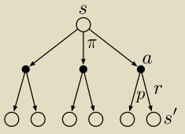
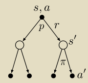
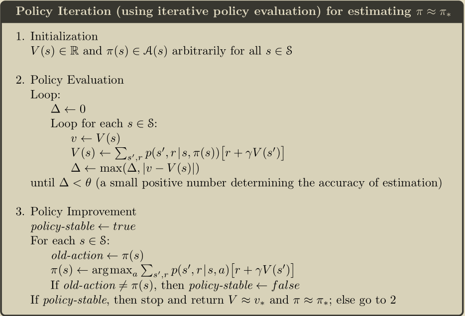

# 强化学习

## 导论

#### 符号表：

|      符号       | 含义                                                         |
| :-------------: | ------------------------------------------------------------ |
|  $\mathcal{S}$  | set of all nonterminal states                                |
| $\mathcal{S}^+$ | set of all states, including the terminal states             |
|       $T$       | final time step of an episode                                |
|    $\gamma$     | discount-rate parameter                                      |
|   $\pi(a|s)$    | probability of taking action $a$ in state $s$ under stochastic policy $\pi$ |
|                 |                                                              |
|                 |                                                              |
|                 |                                                              |
|                 |                                                              |

## 有限马尔可夫决策过程

#### `Return`($G_t$)

​	1）最简单的情形：
$$
G_t \doteq R_{t+1}+R_{t+2}+R_{t+3}+\dots+R_T
$$
​	2）折扣回报：
$$
G_t \doteq R_{t+1}+\gamma R_{t+2}+\gamma^2 R_{t+3}+\dots = \sum_{k=0}^\infin \gamma^kR_{t+1+k} = R_{t+1}+\gamma G_{t+1}
$$

#### $v(s)$与$q(s,a)$的backup diagram：

    
    

$$
v_\pi(s) = \sum_a\pi(a|s)q_\pi(s,a)
$$

$$
\begin{equation}\begin{aligned}
q_\pi(s,a) &\doteq \mathbb{E}[R_{t+1}+\gamma v_\pi(S_{t+1})|S_t=s,A_t=a]\\
&= \sum_{s',r}p(s',r|s,a)[r+\gamma v_\pi(s')]
\end{aligned}\end{equation}
$$

#### `Bellman`方程：

$$
\begin{equation}\begin{aligned}
v_\pi(s) &\doteq \mathbb{E}_\pi[G_t|S_t=s]\\
&= \mathbb{E}_\pi[R_{t+1}+\gamma G_{t+1})|S_t=s]\\
&= \mathbb{E}_\pi[R_{t+1}+\gamma v_\pi(S_{t+1})|S_t=s]\\
&= \sum_a \pi(a|s)\sum_{s',r}p(s',r|s,a)[r+\gamma v_\pi(s')]\\
\end{aligned}\end{equation}
$$

#### `Bellman`最优方程：

$$
\begin{equation}\begin{aligned}v_*(s) &= \max_a \mathbb{E}[R_{t+1}+\gamma v_*(S_{t+1})|S_t=s,A_t=a]\\&= \max_a \sum_{s',r}p(s',r|s,a)[r+\gamma v_*(s')]\end{aligned}\end{equation}
$$

$$
\begin{equation}\begin{aligned}q_*(s,a) &= \mathbb{E}[R_{t+1}+\gamma \max_{a'}q_*(S_{t+1},a')|S_t=s,A_t=a] \\&= \sum_{s',r}p(s',r|s,a)[r+\gamma \max_{a'}q_*(s',a')]\end{aligned}\end{equation}
$$

## 动态规划

#### Policy Evaluation（prediction problem ）

> 对于给定的策略，计算状态价值函数。

利用`Bellman`方程，对于序列$v_0,v_1,v_2,\dots$，我们可以得到更新策略如下：
$$
\begin{equation}\begin{aligned}
v_{k+1} &\doteq \mathbb{E}[R_{t+1}+\gamma v_k(S_{t+1})|S_t=s]\\
&= \sum_a\pi(a|s)\sum_{s',r}p(s',r|s,a)[r+\gamma v_k(s')]
\end{aligned}\end{equation}
$$
算法框图如下（in-place）:

#### Policy Improvement

> 通过在原有策略上改进，使新策略对价值函数更加贪心。

$$
\begin{equation}\begin{aligned}
\pi'(s) &\doteq \arg\max_a q_\pi(s,a)\\
&= \arg \max_a \mathbb{E}[R_{t+1}+\gamma v_\pi(S_{t+1})|S_t=s,A_t=a] \\
&= \arg \max_a\sum_{s',r}p(s',r|s,a)[r+\gamma v_\pi(s')]
\end{aligned}\end{equation}
$$

#### Policy Iteration

