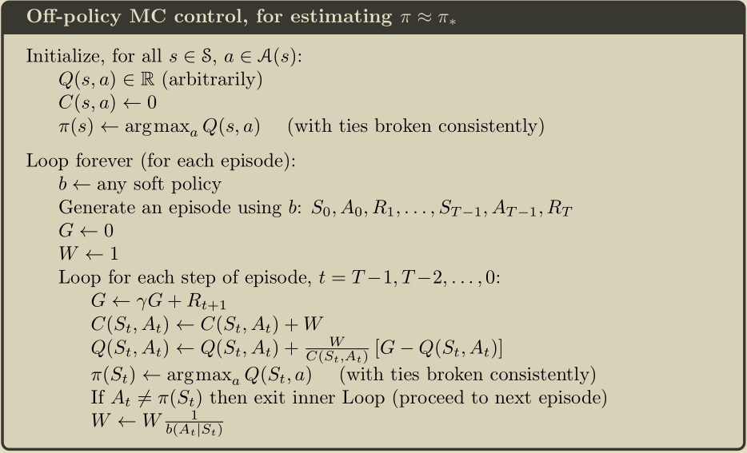

# 强化学习

## 导论

#### 符号表：

|          符号          | 含义                                                         |
| :--------------------: | ------------------------------------------------------------ |
|     $\mathcal{S}$      | set of all nonterminal states                                |
|    $\mathcal{S}^+$     | set of all states, including the terminal states             |
|          $T$           | final time step of an episode                                |
|        $\gamma$        | discount-rate parameter                                      |
|       $\pi(a|s)$       | probability of taking action $a$ in state $s$ under stochastic policy $\pi$ |
|     $\mathcal{A}$      | set of actions                                               |
|     $\mathcal{R}$      | set of all possible rewards, a finite subset of $\mathbb{R}$ |
|    $\mathcal{T}(s)$    | set of all time steps in which state $s$ is visited in MC    |
|         $T(t)$         | the first time of termination following time $t$             |
| $\alpha$,$\alpha_t(a)$ | step size parameter                                          |
|                        |                                                              |

## 多臂赌博机

#### 动作值方法

1）最简单的做法（sample-average）：
$$
Q_t(a) \doteq \frac{\sum_{i=1}^{t-1}R_i\ell_{A_i=a}}{\sum_{i=1}^{t-1}\ell_{A_i=a}}
$$
*nonstationary：动作值的改变（the true values of the actions changed over time)*

2）加权平均（exponential recency-weighted average)：
$$
Q_{n+1} \doteq  (1-\alpha)^nQ_1+\sum_{i=1}^n\alpha(1-\alpha)^{n-i}R_i
$$

#### 增量式实现

$$
NewEstimate \leftarrow OldEstimate +StepSize[Target-OldEstimate]
$$

#### 跟踪非稳态问题

> 常用的方法之一是采用固定步长。

$$
Q_{n+1} \doteq Q_n+\alpha[R_n-Q_{n}]
$$

以概率1收敛的充分条件为：
$$
\sum_{n=1}^\infin \alpha_n(a) = \infin\quad\text{and}\quad\sum_{n=1}^\infin \alpha_n(a)^2 < \infin
$$
**备注**：第一个条件保证了有无穷多步参与运算，从而消除扰动和初始干扰；第二个条件保证了最终步长会趋于0，即收敛的必要条件。对于固定步长，显然，并不满足第二个条件，但是却能很好的用于非稳态问题中。

#### 乐观初始值

> The downside is that the initial estimates become, in effect, a set of parameters that must be picked by the user, if only to set them all to zero. The upside is that they provide an easy way to supply some prior knowledge about what level of rewards can be expected.

乐观的初始值还能用来鼓励探索。但是这种鼓励只是暂时的，因此对于非稳态问题而言，可能效果并不显著。

#### Upper-Confidence-Bound 动作选择

$$
A_t \doteq \arg\max_a[Q_t(a)+c\sqrt\frac{\ln t}{N_t(a)}]
$$

#### 梯度赌博机算法

> Consider learning a numerical preference for each action a , which we denote $H _t ( a )$

$$
\Pr\{A_t=a\} \doteq \frac{e^{H_t(a)}}{\sum_{b=1}^k e^{H_t(a)}} \doteq \pi_t(a)
$$

更新规则：
$$
H_{t+1}(A_t) \doteq H_t(A_t)+\alpha(R_t-\bar{R}_t)(1-\pi_t(A_t))\quad \text{and}\\
H_{t+1}(a) \doteq H_t(a)-\alpha(R_t-\bar{R}_t)\pi_t(a)\quad \text{for all }a\neq A_t
$$

#### Associative Search（Contextual Bandits）

Associative search tasks are intermediate between the k-armed bandit problem and the full reinforcement learning problem. They are like the full reinforcement learning problem in that they involve learning a policy, but like
our version of the k-armed bandit problem in that each action affects only the immediate reward. If actions are allowed to affect the next situation as well as the reward, then we have the full reinforcement learning problem.

#### Parameter Study

## 有限马尔可夫决策过程

#### 智能体（agent)-环境交互

在一个有限马尔可夫决策过程中，状态集、动作集以及奖赏元素都是有限的。

***马尔可夫性（Markov Property）***：在强化学习中，常被称作环境或MDP的动态性（Dynamics)
$$
p(s',r|s,a) \doteq \Pr\{S_t = s',R_t=r|S_{t-1}=s,A_{t-1}=a\}
$$
在利用强化学习解决实际问题时，如何选择动作和状态有时候更像是一门艺术，而非科学，更好的动作和状态集有时候对于问题的解决更有帮助；当然，如何设计奖赏函数更是一个极大的难题，一个基本的原则是：奖赏应当用来告诉智能体要做什么，而非怎么做。

#### `Return`($G_t$)

​	1）最简单的情形：
$$
G_t \doteq R_{t+1}+R_{t+2}+R_{t+3}+\dots+R_T
$$
2）折扣回报：
$$
G_t \doteq R_{t+1}+\gamma R_{t+2}+\gamma^2 R_{t+3}+\dots = \sum_{k=0}^\infin \gamma^kR_{t+1+k} = R_{t+1}+\gamma G_{t+1}
$$

**统一**：将终止状态视作吸收状态，奖赏始终为0，即：

从而可以将回报统一写作：
$$
G_t \doteq \sum_{k=t+1}^T\gamma^{k-t-1}R_k
$$

#### 策略与价值函数

***策略***（policy）：从状态到执行该动作的概率的映射。

***价值函数***（value function）：

1）状态价值函数$v_\pi(s)$（state-value function for policy $\pi$）
$$
v_\pi(s) \doteq \mathbb{E}_\pi[G_t|S_t=s]=\mathbb{E}_\pi[\sum_{k=0}^\infin\gamma^kR_{t+k+1}|S_t=s]
$$
2）动作价值函数$q_\pi(s,a)$（action-value function for policy $\pi$）
$$
q_\pi(s,a) \doteq \mathbb{E}_\pi[G_t|S_t=s,A_t=a]=\mathbb{E}_\pi[\sum_{k=0}^\infin\gamma^kR_{t+k+1}|S_t=s,A_t=a]
$$

#### $v(s)$与$q(s,a)$的backup diagram

    
    

*备注：上图中，每个空心圆圈表示一个状态；每个实心圆圈表示一个动作-状态对。*
$$
v_\pi(s) = \sum_a\pi(a|s)q_\pi(s,a)
$$

$$
\begin{equation}\begin{aligned}
q_\pi(s,a) &\doteq \mathbb{E}[R_{t+1}+\gamma v_\pi(S_{t+1})|S_t=s,A_t=a]\\
&= \sum_{s',r}p(s',r|s,a)[r+\gamma v_\pi(s')]
\end{aligned}\end{equation}
$$

#### 最优策略与最优价值函数

最优策略即能使智能体达到最大总期望奖赏的策略。最优策略拥有最优的状态价值函数和动作价值函数。
$$
v_*(s) \doteq \max_\pi v_\pi(s)
$$

$$
q_*(s,a) \doteq \max_\pi q_\pi(s,a)
$$

$$
q_*(s,a)=\mathbb{E}[R_{t+1}+\gamma v_*(S_{t+1})|S_t=s,A_t=a]
$$

#### `Bellman`方程：

$$
\begin{equation}\begin{aligned}
v_\pi(s) &\doteq \mathbb{E}_\pi[G_t|S_t=s]\\
&= \mathbb{E}_\pi[R_{t+1}+\gamma G_{t+1})|S_t=s]\\
&= \mathbb{E}_\pi[R_{t+1}+\gamma v_\pi(S_{t+1})|S_t=s]\\
&= \sum_a \pi(a|s)\sum_{s',r}p(s',r|s,a)[r+\gamma v_\pi(s')]\\
\end{aligned}\end{equation}
$$

$$
\begin{equation}\begin{aligned}
q_\pi(s,a) &= \mathbb{E}_\pi[R_{t+1}+\gamma v_\pi(S_{t+1})|S_t=s,A_t=a]\\
&= \sum_{s',r}p(s',r|s,a)[r+\gamma v_\pi(s)] \\
&= \sum_{s',r}p(s',r|s,a)[r+\gamma\sum_{a'}\pi(a'|s')q(s',a')]
\end{aligned}\end{equation}
$$

#### `Bellman`最优方程：

$$
\begin{equation}\begin{aligned}
v_*(s) &= \max_{a\in \mathcal{A(s)}}q_*(s,a) \\
&= \max_a\mathbb{E}_{\pi_*}[G_t|S_t=s,A_t=a] \\
&= \max_a \mathbb{E}[R_{t+1}+\gamma v_*(S_{t+1})|S_t=s,A_t=a]\\
&= \max_a \sum_{s',r}p(s',r|s,a)[r+\gamma v_*(s')]
\end{aligned}\end{equation}
$$

$$
\begin{equation}\begin{aligned}q_*(s,a) &= \mathbb{E}[R_{t+1}+\gamma \max_{a'}q_*(S_{t+1},a')|S_t=s,A_t=a] \\&= \sum_{s',r}p(s',r|s,a)[r+\gamma \max_{a'}q_*(s',a')]\end{aligned}\end{equation}
$$

直接求解贝尔曼最优方程的困难：

1）环境动态可能不尽知；

2）当前算力不足以应对指数级增长的状态和状态-动作对；

3）实际问题不满足马尔可夫性

## 动态规划

#### Policy Evaluation（prediction problem ）

> 对于给定的策略，计算状态价值函数。

利用`Bellman`方程，对于序列$v_0,v_1,v_2,\dots$，我们可以得到更新策略如下：
$$
\begin{equation}\begin{aligned}
v_{k+1}(s) &\doteq \mathbb{E}[R_{t+1}+\gamma v_k(S_{t+1})|S_t=s]\\
&= \sum_a\pi(a|s)\sum_{s',r}p(s',r|s,a)[r+\gamma v_k(s')]
\end{aligned}\end{equation}
$$
算法框图如下（in-place）:

#### Policy Improvement

> 通过在原有策略上改进，使新策略对价值函数更加贪心。

$$
\begin{equation}\begin{aligned}
\pi'(s) &\doteq \arg\max_a q_\pi(s,a)\\
&= \arg \max_a \mathbb{E}[R_{t+1}+\gamma v_\pi(S_{t+1})|S_t=s,A_t=a] \\
&= \arg \max_a\sum_{s',r}p(s',r|s,a)[r+\gamma v_\pi(s')]
\end{aligned}\end{equation}
$$

#### Policy Iteration

#### Truncated Policy Iteration

1) Truncated Policy Evaluation

2) Truncated Policy Iteration

#### Value Iteration

> 实际上，价值更新（Value Iteration）就是把贝尔曼最优方程直接变成了更新规则；也可以将其视作截断策略迭代（Truncated Policy Iteration）的特殊情况：策略评估（Policy Evaluation）对每个状态只做一次交换（sweep）。

$$
\begin{equation}\begin{aligned}
v_{k+1}(s) &\doteq \max_a \mathbb{E}[R_{t+1}+\gamma v_k(S_{t+1})|S_t=s,A_t=a]\\
&= \max_a \sum_{s',r}p(s',r|s,a)[r+\gamma v_k(s')]
\end{aligned}\end{equation}
$$

#### 异步动态规划

> 所谓的异步动态规划指的是这么一类算法：即就地（in-place）迭代动态规划，并非系统地对所有状态进行交换（sweep），而是使用任意可用的状态值，以任意顺序来更新状态值。

异步动态规划并不意味着使价值函数收敛所需的算力显著减少。它的重要之处体现在：一方面，能合理避免没有明显价值的迭代，从而把算力集中在更重要的状态更新上；另一方面，是实现在线学习的重要工具。 

#### 广义策略迭代

可以将广义策略迭代（GPI）视作竞争与合作并存的过程。竞争体现在：策略评估与策略改进这两个子过程是存在矛盾的，因为策略评估会让当前的价值函数与策略更加一致，从而可能会让策略变得不再贪心；而策略改进会让策略本身变得更加贪心，从而价值函数不再完全正确。合作体现在：这两个子过程并非非此即彼的关系，它们的相互作用最终会得到一个最优策略和最优价值函数，从而消除矛盾，如下图所示：

最后介绍一个概念：**自举**（bootstrapping），即基于后继者的估计之上的估计（针对DP而言）。强化学习中，很多算法都用到了自举。

## 蒙特卡洛方法

蒙特卡洛方法即通过平均采样回报来解决强化学习问题，因此，一般地，蒙特卡洛方法只定义在分幕式任务（episodic task）上。

#### 蒙特卡洛预测

Every-visit和First-visit的区别在于：它不需要对$S_t$是否出现在该幕（episode）更早时候。

上面的算法框中描述的算法是用来预测状态值的。如果我们想预测动作值，只需要将相应的状态改为状态-动作对即可。但是这样我们会遇到maintaining exploration的问题，也就是说，不能保证所有动作状态对都能被充分访问到。解决这个问题的方法之一是：采用exploring starts，即将每个动作-状态对以非零概率作为一个episode的起始。当然，更普遍的解决方案是采用stochastic的策略，确保每个动作状态对被选择的概率都不为0，尤其是当智能体是通过实际的交互经验来学习的时候，exploring starts将不能应用。

#### 蒙特卡洛控制

> 即采用蒙特卡洛预测来近似最优策略。

#### 无探索性起始的蒙特卡洛控制

> On-policy methods attempt to evaluate or improve the policy that is used to make decisions, whereas o↵-policy methods evaluate or improve a policy different from that used to generate the data.

在同轨（on-policy）控制方法中，策略通常是软性的（soft），即$\pi(a|s)>0$，但是会逐渐转变为确定的最优策略。

常用的$\epsilon-soft$策略为$\epsilon-greedy$，即：对于非贪心动作，其被选择的概率为：$\frac{\epsilon}{|\mathcal{A{s}}|}$；而对于贪心动作，其被选择的概率为：$1-\epsilon+\frac{\epsilon}{|\mathcal{A{s}}|}$。

#### 基于重要性采样的离轨预测

> The policy being learned about is called the target policy, and the policy used to generate behavior is called the behavior policy.

由于采样数据依据的策略与学习的策略不同，因此，离轨策略方法通常方差更大，而且收敛更慢；但是，离轨策略方法更为强大。

在预测问题中，我们要求：当$\pi(a|s)>0$时，有$b(a|s)>0$。（收敛假设）

重要性采样率（轨迹为：$A_t,S_{t+1},A_{t+1},\dots,S_T$）：
$$
\rho_{t:T-1} \doteq \frac{\prod^{T-1}_{k=t}\pi(A_k|S_k)p(S_{k+1}|S_k,A_k)}{\prod^{T-1}_{k=t}b(A_k|S_k)p(S_{k+1}|S_k,A_k)} = \prod^{T-1}_{k=t}\frac{\pi(A_k|S_k)}{b(A_k|S_k)}
$$
因此，我们可以得到，在基于目标策略$\pi$下，状态的价值：
$$
\mathbb{E}[\rho_{t:T-1}G_t|S_t=s]=v_\pi(s)
$$
即（ordinary importance sampling)：
$$
V(s) \doteq \frac{\sum_{t \in \mathcal{T(s)}}\rho_{t:T(t)-1}G_t}{|\mathcal{T}(s)|}
$$
另一种做法是采用weighted importance sampling，即（如果分母为0，则状态值为0）：
$$
V(s) \doteq \frac{\sum_{t \in \mathcal{T(s)}}\rho_{t:T(t)-1}G_t}{\sum_{t \in \mathcal{T(s)}}\rho_{t:T(t)-1}}
$$
对比：ordinary-importance sampling是无偏的，但是方差更大；weighted-importance sampling是有偏的，但是方差更小（first-visit）。

#### 增量式实现

#### Off-policy MC 控制

## 时序差分学习

#### TD 预测

最简单的TD更新规则：
$$
V(S_t) \leftarrow V(S_t)+\alpha[R_{t+1}+\gamma V(S_{t+1})-V(S_t)]
$$

定义TD误差如下：
$$
\delta_t \doteq R_{t+1}+\gamma V(S_{t+1})-V(S_t)
$$
那么，在假设$V$在整个$G_t$产生的过程中不变（像MC方法中那样），我们可以得到：
$$
\begin{equation}\begin{aligned}
G_t-V(S_t) &= R_{t+1}+\gamma G_{t+1}-V(S_t)+\gamma V(S_{t+1})-\gamma V(S_{t+1})\\
&= \delta_t+\gamma(G_{t+1}-V(S_{t+1})) \\
&= \delta_t + \gamma \delta_{t+1}+\gamma^2(G_{t+2}-V(S_{t+2}))\\
&= \sum_{k=t}^{T-1}\gamma^{k-t}\delta_k
\end{aligned}\end{equation}
$$
当然，实际上在TD(0)中，$V$在$G_t$产生的过程中是不断变化的，不过上面的式子在步长很小的时候仍然近似成立。

#### Sarsa：同轨TD控制

更新规则：
$$
Q(S_t,A_t) \leftarrow Q(S_t,A_t)+\alpha[R_{t+1}+\gamma Q(S_{t+1},A_{t+1})-Q(S_t,A_t)]
$$
